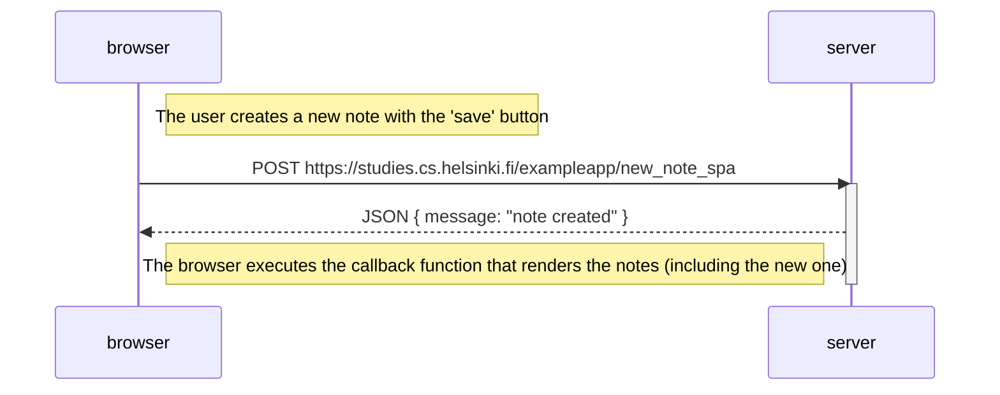

# 0.6: New note in Single page app diagram

Full Stack open exercise 0.6: Sequence diagram for creating a new note
on the [notes single page app](https://studies.cs.helsinki.fi/exampleapp/spa).

```mermaid
sequenceDiagram
    participant browser
    participant server

	Note right of browser: The user creates a new note with the 'save' button

    browser->>server: POST https://studies.cs.helsinki.fi/exampleapp/new_note_spa
    activate server
    server-->>browser: JSON { message: "note created" }

	Note right of browser: The browser executes the callback function that renders the notes (including the new one)

    deactivate server
```
